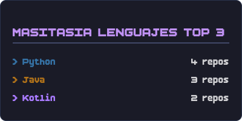

# Estadísticas de Github (Estilo Pixel)

Generador dinámico de tarjetas de estadísticas para perfiles de GitHub. Creado con Next.js y Satori, renderiza SVGs que puedes descargar.

## Características

- **Estéticas Gamer:** Interfaz oscura, fuente pixelada "BoldPixels" y componentes de Lucide Icons.

- **Renderizado Rápido:** Genera imágenes SVG estáticas y ultraligeras.

- **GraphQL Powered:** Utiliza la API oficial de Github GraphQL para recibir los datos.

## Uso

Aún no ha sido publicado

---
Hecho por **MasitasIA**. Inspirado en el repositorio de https://github.com/anuraghazra/github-readme-stats